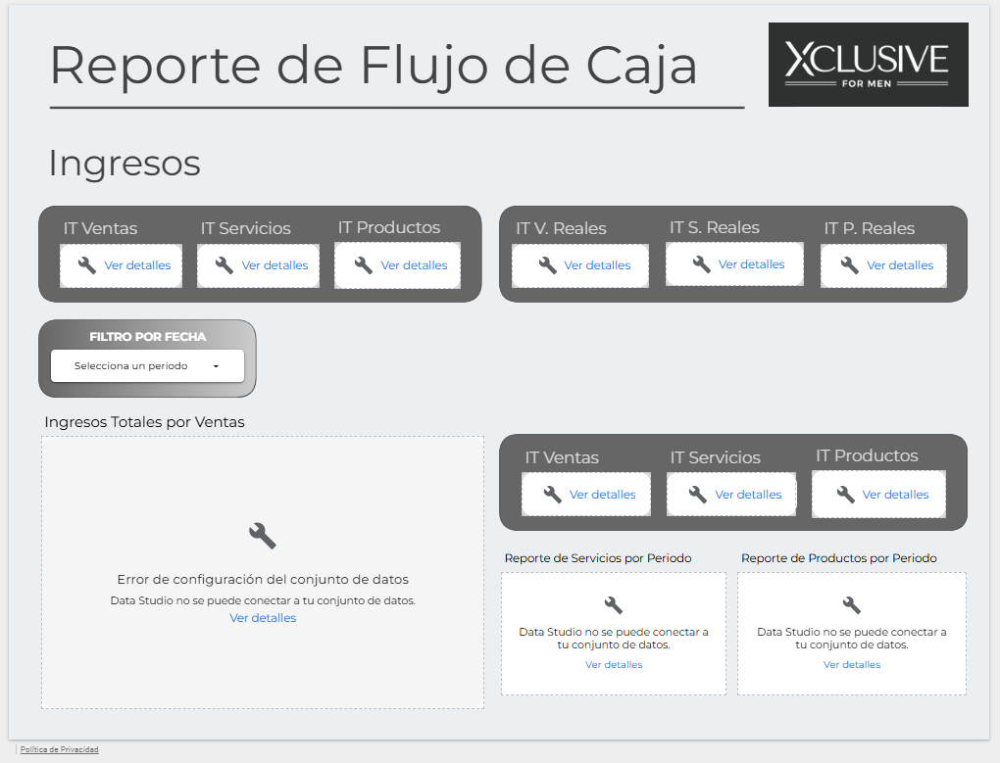
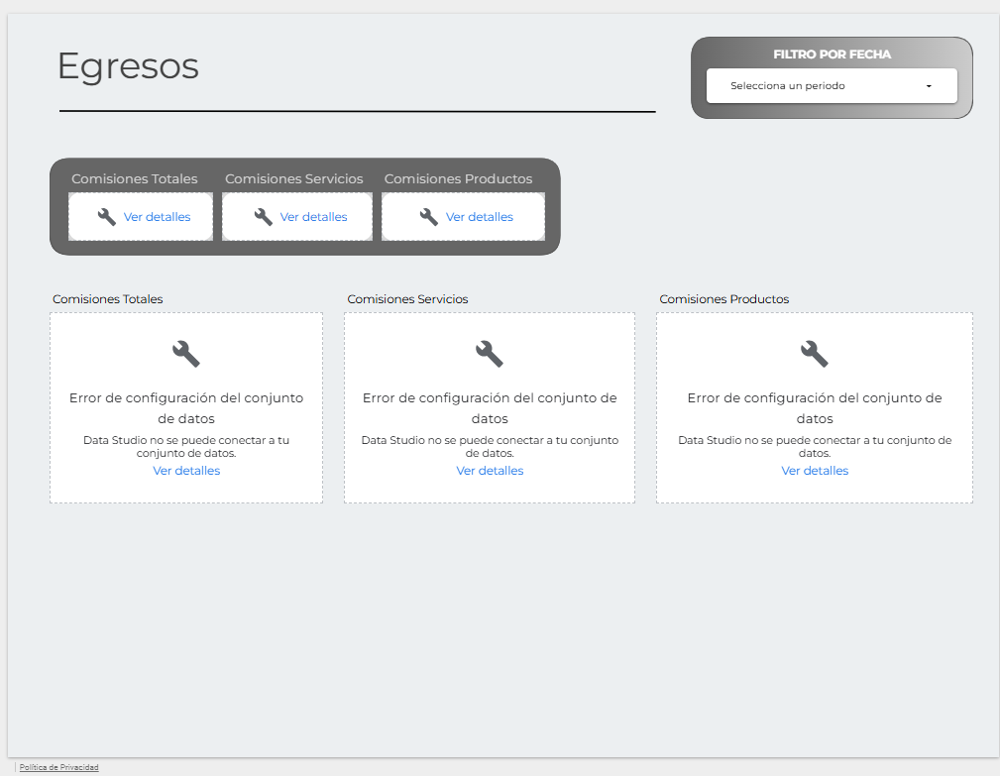

## 📊 Sistema de Automatización de Ventas, Egresos y Flujo de Caja

Desarrollé una solución end-to-end de automatización para la gestión financiera operativa, orientada a la captura, procesamiento, modelado y visualización de datos en tiempo real. El sistema integra múltiples componentes para garantizar consistencia, trazabilidad y disponibilidad de la información.

### 🧩 Arquitectura de la solución

La solución está basada en una arquitectura ligera tipo ELT (Extract, Load, Transform), donde:

- **Google Sheets** funciona como capa de almacenamiento (data layer) y punto central de consolidación
- **Google Apps Script** actúa como capa de lógica de negocio y procesamiento (transform layer)
- **Looker Studio** opera como capa de visualización (presentation layer), consumiendo directamente los datos estructurados desde Google Sheets

### ⚙️ Procesamiento y automatización

Se implementaron scripts en **Google Apps Script** para:

- Automatizar el registro y validación de transacciones (ventas y egresos)
- Estandarizar estructuras de datos mediante normalización de inputs
- Ejecutar cálculos dinámicos para la generación del flujo de caja
- Sincronizar y mantener la integridad entre múltiples hojas (datasets relacionados)
- Reducir intervención manual mediante triggers y funciones personalizadas

### 📥 Ingesta y modelado de datos

El sistema permite:

- Registro estructurado de ingresos segmentados por **productos y servicios**
- Registro de **egresos categorizados** (operativos, administrativos, etc.)
- Consolidación en un modelo de datos tabular optimizado para análisis
- Generación automática de métricas financieras clave (cash flow, saldo acumulado, variaciones)

### 📊 Visualización y analítica (BI)

Se utilizó **Looker Studio** como herramienta de Business Intelligence para consumir los datos desde Google Sheets y transformarlos en dashboards interactivos.

- Conexión directa a la fuente de datos (Google Sheets connector)
- Modelado semántico para facilitar el análisis (campos calculados, métricas derivadas)
- Visualización de indicadores clave:
  - Flujo de caja en diferentes granularidades (diaria, semanal, mensual)
  - Ingresos vs egresos
  - Evolución de la liquidez
- Actualización en tiempo real mediante sincronización automática con la fuente

### 🔗 Acceso a datos

- 📄 **Google Sheets (Data Source):**  
  [Ver archivo](https://docs.google.com/spreadsheets/d/16Jjy5VRyReh5a9g2i3k2aXCtHtw0qzgmY6ReUvvI2fo/edit?usp=sharing)

### 🔒 Dashboard

Por temas de seguridad y confidencialidad, no es posible compartir el enlace del dashboard en Looker Studio, ya que se encuentra conectado a información en tiempo real. A continuación, se presentan vistas representativas del sistema.

### 🖼️ Vistas del Dashboard

#### Ingresos

#### Egresos

> Asegúrate de que las imágenes estén en la raíz del repositorio o ajusta la ruta según tu estructura.

### 🎯 Resultados y valor generado

- Pipeline automatizado de datos financieros con mínima intervención manual
- Reducción significativa de errores operativos en el registro y consolidación
- Disponibilidad de información financiera en tiempo real
- Mejora en la toma de decisiones basada en datos (data-driven)
- Escalabilidad para incorporar nuevas fuentes y métricas

### 🛠️ Stack tecnológico

- **Google Sheets** (Data Storage / Data Modeling)
- **Google Apps Script** (Automation / Data Processing)
- **Looker Studio** (Data Visualization / BI)

---
